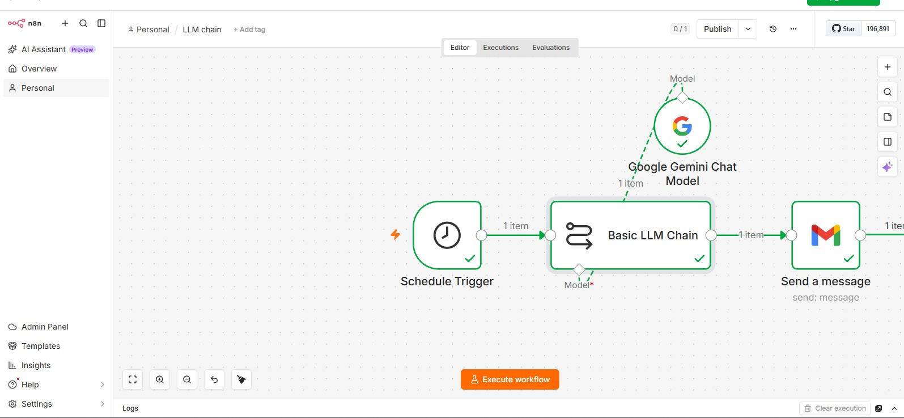
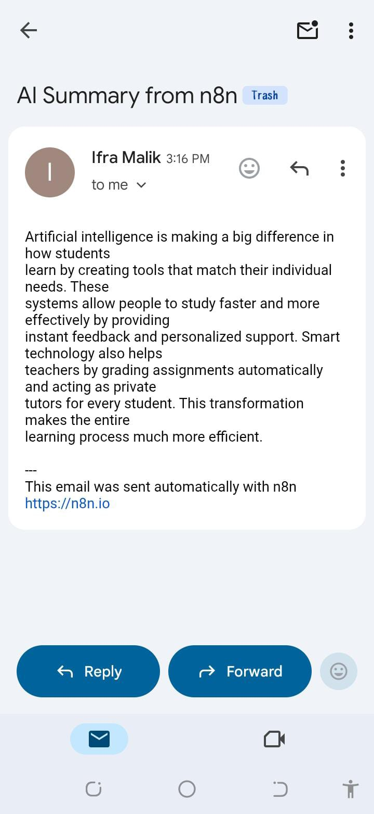

# AI-Powered Text Summarization and Email Automation

An AI-powered automation workflow built using n8n that automatically summarizes text using Google Gemini AI and sends the generated summary through Gmail.

## Overview

This project demonstrates how no-code automation can be combined with Artificial Intelligence to automate content summarization and email delivery.

The workflow:
1. Runs automatically using a Schedule Trigger.
2. Sends text to Google Gemini AI for summarization.
3. Generates a concise summary using Basic LLM Chain.
4. Sends the AI-generated summary through Gmail.

## Workflow

Schedule Trigger  
↓  
Google Gemini AI (Basic LLM Chain)  
↓  
Gmail Email Notification  

## Technologies Used

- n8n Automation Platform
- Google Gemini AI
- Gmail API Integration
- AI Workflow Automation

## Features

- Automated text summarization
- AI-powered content processing
- Automatic email delivery
- Scheduled workflow execution

## Use Cases

- Daily news summaries
- Research paper summaries
- Meeting notes summarization
- Study material summarization

## Screenshot

  

  

## Workflow JSON

The exported n8n workflow JSON is included in this repository.
